# 1. Git概述

&emsp;Git是一个免费的、开源的分布式版本控制系统。Git性能极快，优于Subversion、CVS等版本控制工具。<br>
&emsp;Git官网：https://git-scm.com/

## 1.1 何为版本控制

&emsp;版本控制是一种记录文件内容变化，以便来查看特定版本修订情况的系统。<br>
&emsp;版本控制最重要的是可以记录文件修改历史记录，从而让用户能够查看历史版本，方便版本切换。<br>

## 1.2 为什么需要版本控制

&emsp;个人开发过渡到团队协作。

## 1.3 版本控制工具

&emsp; **集中式版本控制工具：** CVS、SVN(Subversion)、VSS...<br>
&emsp;集中化的版本控制系统都有一个单利的集中管理的服务器，保存所有文件的修订版本，而协同工作的人员都通过客户端连接到这台服务器，取出最新的文件或提交更新。<br>
&emsp;这种方法的好处是每个人都可以在一定程度上看到项目中其他人在做什么，管理员也可以轻松掌握每个开发者的权限，并且管理一个集中化的版本控制系统，要远比在各个客户端上维护本地数据库来的轻松。坏处是如果服务器宕机，那么都无法进行提交操作。<br>
&emsp;**分布式版本控制工具：** Git、Mercurial...<br>
&emsp;像git这种分布式版本控制工具，客户端提取的不是最新版本的文件快照，而是吧代码残酷完整的镜像下来(本地库)
。这样在任何一处工作用的文件发售故障，事后都可以在其他客户端的本地仓库进行恢复。因为每一个客户端的每一次文件提取操作，实际上都是一次对整个文件仓库的完整备份。

## 1.4 git工作机制

&emsp;工作区(写代码) ----> git add ----> 暂存区(临时存储) ----> git commit ----> 本地库(历史版本) ----> 远程库<br>
&emsp;一旦文件进入了本地库，就会生成一个对应的历史版本，就无法删除了，除非删除本地库...

## 1.5 Git和代码托管中心

&emsp;代码托管中心是基于网络服务器的远程代码仓库。一般称为远程库。<br>
&emsp;**局域网：**:

* GitLab <br>

&emsp;**互联网：**:

* GitHub(外网)
* Gitee码云(国内网站)
*

---

# 2. Git常用命令

| 命令名称                           | 作用      |
|--------------------------------|---------|
| git config --global user.name  | 设置用户签名  |
| git config --global user.email | 设置用户签名  |
| git init                       | 初始化本地库  |
| git status                     | 查看本地库状态 |
| git add 文件名                    | 添加到暂存区  |
| git commit -m"日志信息" 文件名        | 提交到本地库  |
| git reflog                     | 查看历史记录  |
| git reset --hard 版本号           | 版本穿梭    |

## 2.1 设置用户签名

&emsp;当安装好git后，只需要设置一次用户签名就可以了，如果不设置用户签名，那么在提交代码时会报错。<br>
&emsp;使用命令设置好用户签名后，在 *【C:\Users\当前用户】*  目录下可以看到一个 *.gitconfig* 文件，打开文件就可以看到设置的信息。<br>
&emsp;签名的作用是区分不同操作者身份。用户的签名信息在每一个版本的提交信息中能够看到，以此确认是谁提交的。**git首次安装不能设置用户签名，否则无法提交代码**<br>
&emsp;*注意：这里设置的用户签名和将来登陆GitHub(或者其他代码托管中心)的账号没有任何关联*

## 2.2 初始化本地库

&emsp;要想用git管理目录，首先要git获取到这个目录的管理权，就是要先初始化一下。

```
Baibai@DESKTOP-PA9CAK6 MINGW64 /d/Warehouse/GitHubWareHouse/GitStudy
$ git init
Initialized empty Git repository in D:/Warehouse/GitHubWareHouse/GitStudy/.git/

Baibai@DESKTOP-PA9CAK6 MINGW64 /d/Warehouse/GitHubWareHouse/GitStudy (master)
$ ll -a
total 4
drwxr-xr-x 1 Baibai 197121 0 Jan  2 13:33 ./
drwxr-xr-x 1 Baibai 197121 0 Jan  2 13:33 ../
drwxr-xr-x 1 Baibai 197121 0 Jan  2 13:33 .git/

Baibai@DESKTOP-PA9CAK6 MINGW64 /d/Warehouse/GitHubWareHouse/GitStudy (master)
```

## 2.3 查看本地库状态

&emsp;**命令：git status**

### 2.3.1 首次查看

```
Baibai@DESKTOP-PA9CAK6 MINGW64 /d/Warehouse/GitHubWareHouse/GitStudy (master)
$ git status
On branch master

No commits yet

nothing to commit (create/copy files and use "git add" to track)

Baibai@DESKTOP-PA9CAK6 MINGW64 /d/Warehouse/GitHubWareHouse/GitStudy (master)
```

**On branch master：** 当前分支是master<br>
**No commits yet：** 当前没有提交过，还是个空的<br>
**nothing to commit：** 没有什么需要提交，因为没有新建文件<br>
&emsp;当到该文件夹类名随便创建一个文件后，再来查看本地库状态：<br>

```
Baibai@DESKTOP-PA9CAK6 MINGW64 /d/Warehouse/GitHubWareHouse/GitStudy (master)
$ git status
On branch master

No commits yet

Untracked files:
  (use "git add <file>..." to include in what will be committed)
        first.txt

nothing added to commit but untracked files present (use "git add" to track)
```

&emsp;上面的第三行提示改变了，且first.txt是红色的。表示这个文件虽然有了，但是只存在于工作区。下面的提示就是，虽然你没有添加过文件，但是目录下有一个未被追踪的文件了，需要使用 *git add *
来追踪一下，即将其添加至暂存区。
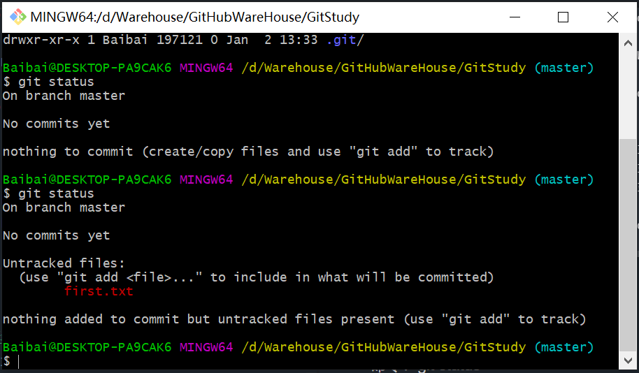

### 2.3.2 新增文件

&emsp;**命令：git add 文件名**

```
Baibai@DESKTOP-PA9CAK6 MINGW64 /d/Warehouse/GitHubWareHouse/GitStudy (master)
$ git add first.txt
```

&emsp;再次查看本地库状态：
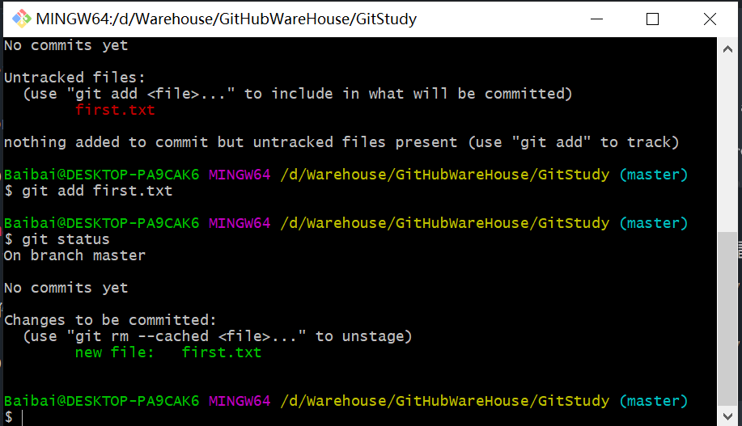
&emsp;可以看到first.txt变成了绿色，表示进入了暂存区，这时如果想删掉这个文件，就需要使用提示的命令<br>
> git rm --cached <file>

&emsp;这样删只是在暂存区删掉了这个文件，工作区还是会存在的。
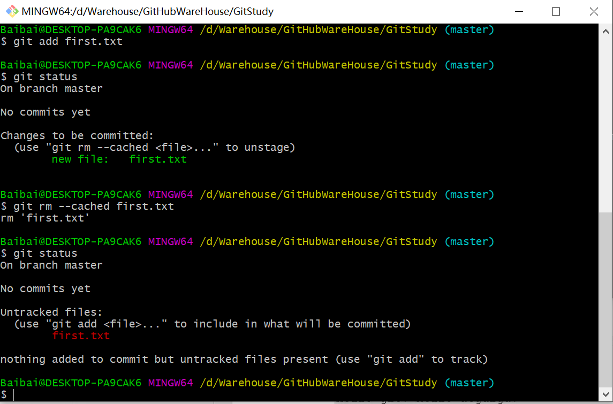

## 2.4 提交至本地库

&emsp;**命令：git commit -m"日志信息" 文件名**
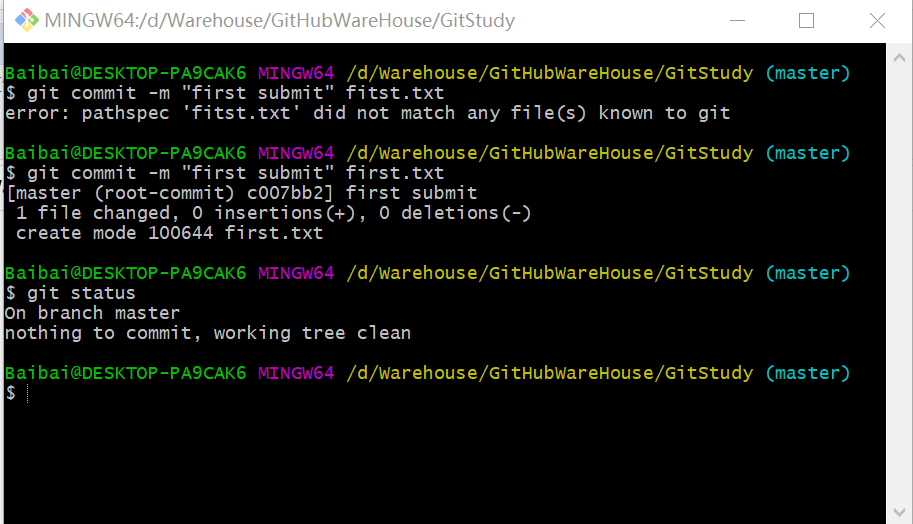

```
$ git commit -m "first submit" fitst.txt
error: pathspec 'fitst.txt' did not match any file(s) known to git

Baibai@DESKTOP-PA9CAK6 MINGW64 /d/Warehouse/GitHubWareHouse/GitStudy (master)
$ git commit -m "first submit" first.txt
[master (root-commit) c007bb2] first submit
 1 file changed, 0 insertions(+), 0 deletions(-)
 create mode 100644 first.txt

Baibai@DESKTOP-PA9CAK6 MINGW64 /d/Warehouse/GitHubWareHouse/GitStudy (master)
$ git status
On branch master
nothing to commit, working tree clean

```

&emsp;**1. [master (root-commit) c007bb2] first submit:** master分支有一次first submit提交一个版本了，first
submit，一个文件被改变，0行内容被插入<br>
&emsp;**2. c007bb2：** 七位的字符码就是版本号<br>
&emsp;**3. nothing to commit, working tree clean：** 表示提交过，并且提交没有新增和修改
<br><br>
**查看版本信息：git reflog**
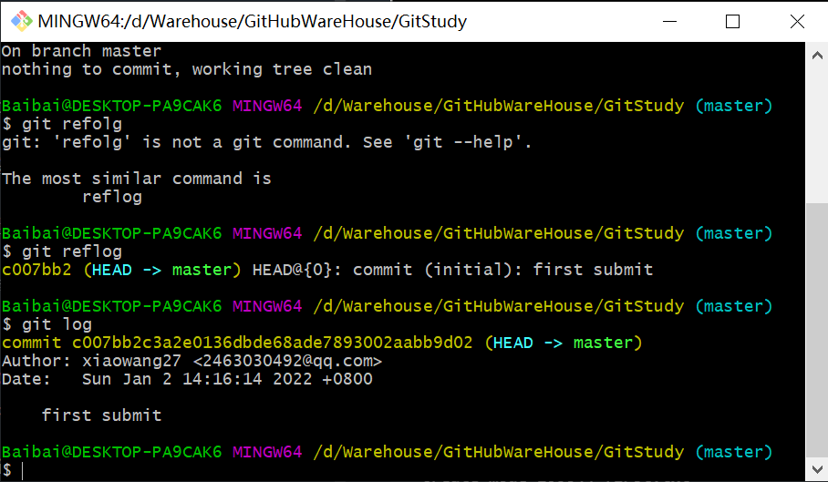

## 2.5 历史版本

### 2.5.1 查看历史版本

&emsp;**基本语法：**

```
git reflog 查看版本信息
git log 查看版本详细信息
```

### 2.5.2 版本穿梭

&emsp;**基本语法：** [git reset --hard 版本号]<br>
&emsp;**演示：**

```
Baibai@DESKTOP-PA9CAK6 MINGW64 /d/Warehouse/GitHubWareHouse/GitStudy (master)
$ git reflog    // 查看版本信息
c46e991 (HEAD -> master) HEAD@{0}: commit: second submit
c007bb2 HEAD@{1}: commit (initial): first submit

Baibai@DESKTOP-PA9CAK6 MINGW64 /d/Warehouse/GitHubWareHouse/GitStudy (master)
$ git reset --hard c007bb2  // 使版本指向版本号为c007bb2的版本
HEAD is now at c007bb2 first submit

Baibai@DESKTOP-PA9CAK6 MINGW64 /d/Warehouse/GitHubWareHouse/GitStudy (master)
$ git reflog    // 查看版本信息
c007bb2 (HEAD -> master) HEAD@{0}: reset: moving to c007bb2
c46e991 HEAD@{1}: commit: second submit
c007bb2 (HEAD -> master) HEAD@{2}: commit (initial): first submit

Baibai@DESKTOP-PA9CAK6 MINGW64 /d/Warehouse/GitHubWareHouse/GitStudy (master)
$
```

<br> 

---

# 3. Git分支

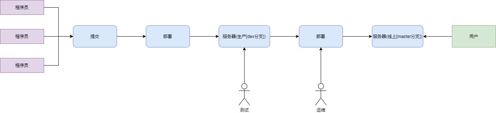
<font color=#c0ff3e>**什么是分支：** <br></font>
&emsp;在版本控制过程中，同时推进多个任务，为每个任务可以创建它的单独分支。使用分支意味着程序员可以把自己的工作从开发主线上分离开来，去开发自己的分支。在开发自己分支时，不会影响主线分支的运行。分支可以简单理解为副本，一个分支就是一个单独的副本。(
分支的底层其实也是指针的引用)
<br>
<font color=#c0ff3e>**分支的好处：**</font>
<br>
&emsp;1. 同时并行推进多个功能开发，提高开发效率 <br>
&emsp;2. 各个分支在开发过程中，如果某一个分支开发失败，不会对其他分支有任何影响。失败的分支删除重新开始即可
<br>

## 3.1 分支的操作

| 命令名称             | 作用              |
|------------------|-----------------|
| git branch 分支名   | 创建分支            |
| git branch -v    | 查看分支            |
| git checkout 分支名 | 切换分支            |
| git merge 分支名    | 把指定的分支合并到当前分支上  |              

### 3.1.1 查看分支
**语法：** git branch -v


### 3.1.2 创建分支
**语法：** git branch 分支名


### 3.1.3 切换分支
**语法：** git checkout 分支名
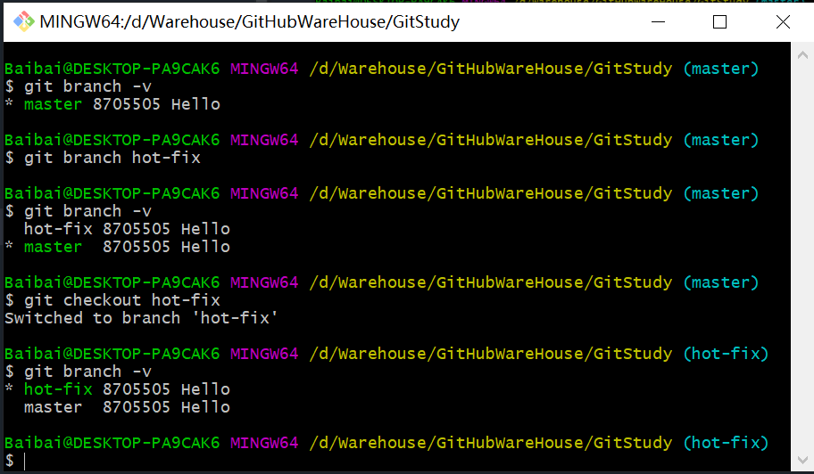

&emsp;在切换分支后，改变first.txt文件里面的内容然后提交，打开本地的first.txt文件，发现内容和之前的不一样了。再将分支切换到master，会发现first.txt的内容又变成之前的了。
<br>

### 3.1.4合并分支
**语法：** git merge 分支名
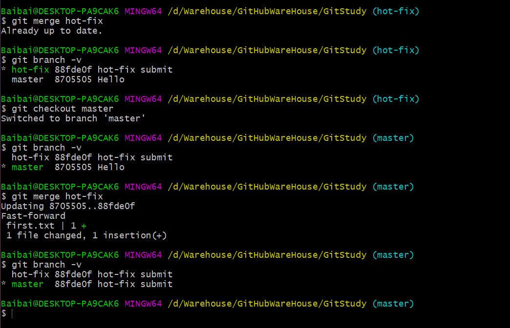
&emsp;合并分支时要注意当前时声明分支，在当前分支下合并当前分支会提示[Already up to date]。

### 3.1.5 合并冲突
&emsp;**产生冲突的表现:** 后面状态为 (分支名|<font color=red>MERGING</font>)<br>
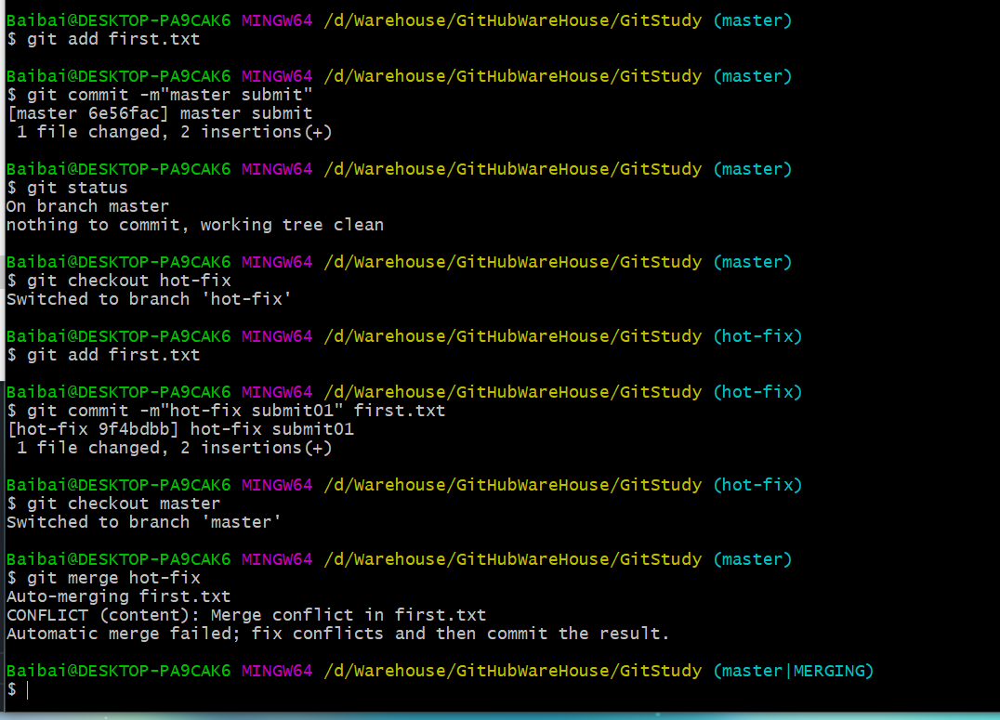
<br>&emsp;如图最后一行的括号里面的内容。在合并的日志也会提示冲突的位置。
<br><br>
&emsp;**产生冲突的原因:** 合并分支时，两个分支在同一个文件的同一个位置有两套完全不同的修改。Git无法替我们决定使用哪一个，必须人为决定新代码内容。<br>
<br>

解决方法
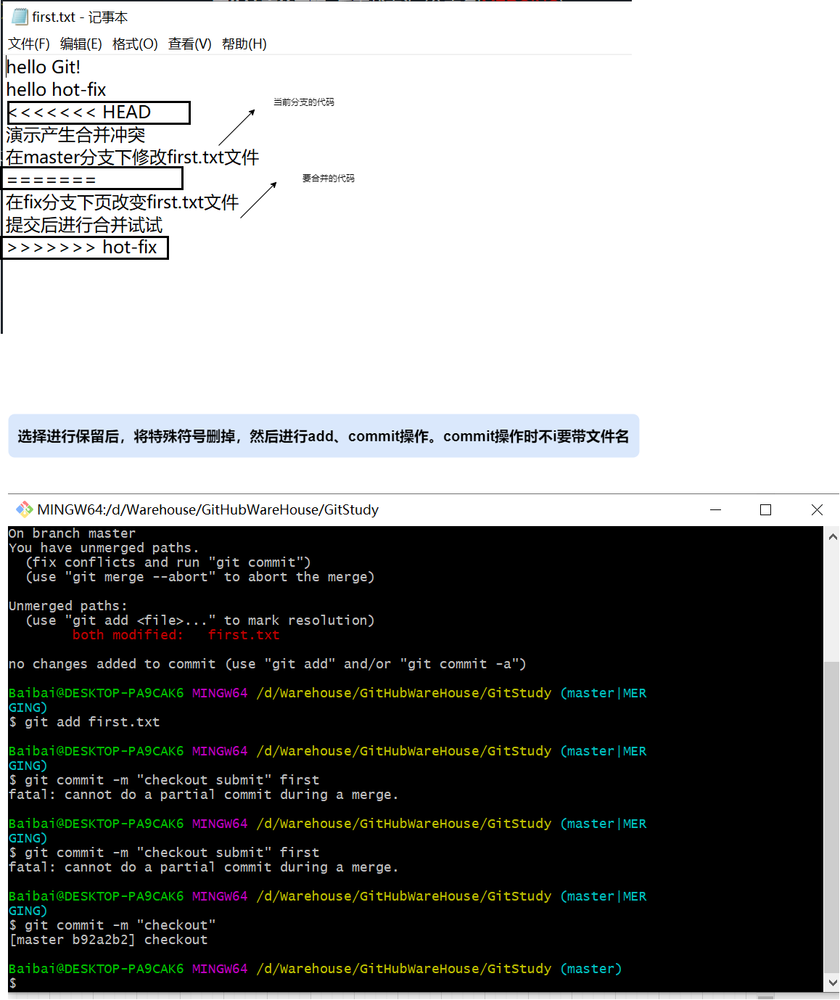
---

# 4. Git团队协作机制
&emsp;有两种：<br>
&emsp; 1. 团队内协作<br>
&emsp; 2. 跨团队协作<br>

---

# 5. GitHub操作

## 5.1 远程库操作
| 命令名称                   | 作用 |
|------------------------| ----|
| git remote -v          | 查看当前所有远程地址别名|
| git remote add 别名 远程地址 | 起别名|
| git push 别名 分支 | 推送本地分支上的内容到远程库 |
| git clone 远程地址 | 将远程仓库的内容克隆到本地 |
| git pull 远程库地址别名 远程分支名 | 将远程仓库对于分支最新内容拉下来后与当前本地分支直接合并 |

### 5.1.1 创建远程仓库别名
&emsp;**基本语法:** 
* git remote add 别名 远程地址 
* git remote -v

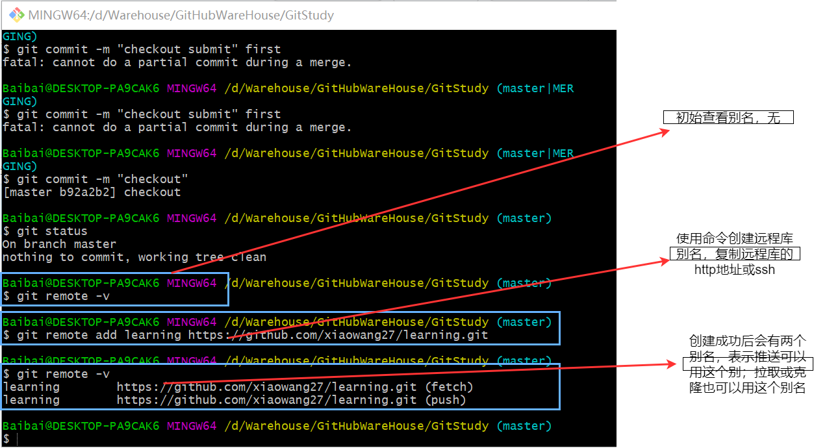

### 5.1.2 推送本地分支到远程库
&emsp;**基本语法:**
* git push 别名 分支
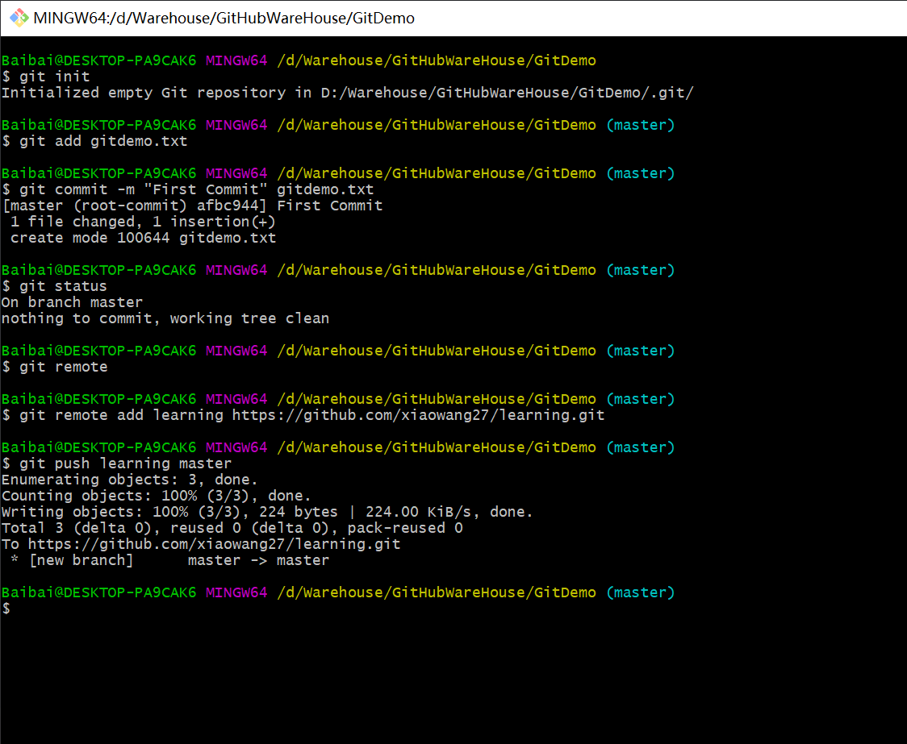
&emsp;**本机推送master分支，就会推送到远程库的master分支下；本机推送main分支，就会推送到远程库的main分支下**

### 5.1.3 拉取远程库到本地库
&emsp;**基本语法:**
* git pull 别名 分支
<br>

&emsp;试验在git的网页段改变文件，然后在本地拉去最新代码。
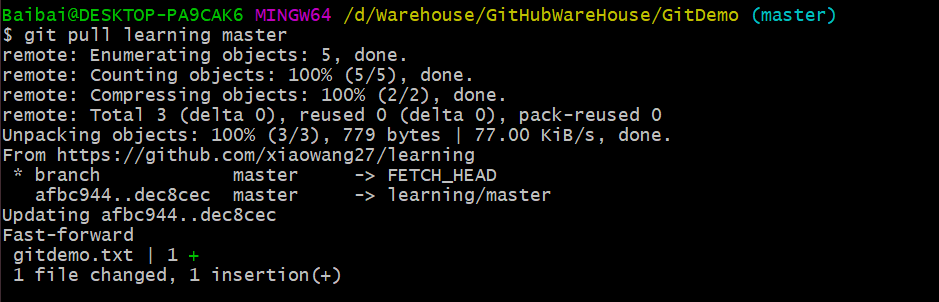

### 5.1.4 克隆远程库到本地
&emsp;**基本语法:**
* git clone 远程地址

### 5.1.5 邀请加入团队
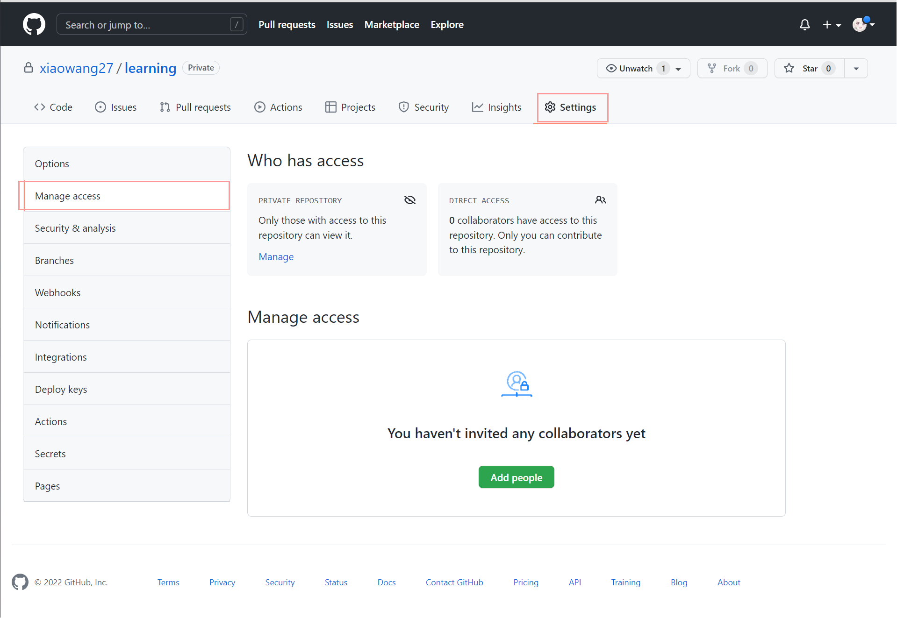

# 7. IDEA集成Git

# 8. IDEA集成GitHub

# 9. 国内代码托管中心-码云

# 10. 自建代码托管平台-GitLab