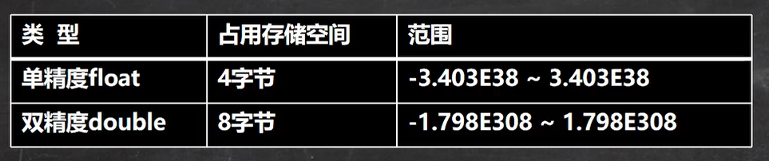

#目录
* 变量介绍
* +号的使用
* 数据类型
* 编码
* 数据类型转换
---
## 变量   
&emsp; 变量是程序的基本组成单位。变量三要素：类型+名称+值。变量相当于内存中一个存储空间的表示。变量名就相到于门牌号，变量值就是房间里的内容。
<br>
* 变量表示内存中的一个存储区域，不同类型的变量所占空间大小不同
* 变量必须要有自己的名称和类型
* 变量必须先声明再使用
* 变量在同一个作用域内不能重名
* 变量=变量类型+变量名+变量值   

---   
## 程序中+号的使用
1. 在左右两边为数值类型时，做加法运算
2. 左右两边任意一方为字符串时，做拼接运算

---
## 数据类型
&emsp; Java是一种强类型的语言。每一种数据都定义了明确的数据类型，在内存中分配了不同大小的空间内存。
 

### 整型

&emsp; 整型的使用细节
* Java各整数类型有固定的范围和长度，不受OS的影响
* Java整型常量默认为int，声明long型常量后面必须加L
* Java中除非int不足以表示，菜使用long
* bit是计算机中最小的存储单位，byte是计算机中最基本的存储单位，1byte=8bit

### 浮点型


&emsp; 浮点数在机器中的存放形式：浮点数=符号位+指数位+尾数位。尾数部分可能丢失，造成精度损失。(小数都是近似值)<br>
&emsp; **浮点数的使用细节：**
* 浮点型也有固定的范围和长度，不受OS的影响。
* Java浮点型默认为double，声明float变量时需要到后面加F
* 浮点型常量有两种表示形式：<br>
十进制数形式:如5.12,5.12f<br>
科学计数法形式:如5.12e2,5.12e-2
* 通常情况下使用double，因为它比float更加精确。
* 浮点数使用陷阱：2.7和8.1/3比较
``` java
        double d1 = 2.7;    // 2.7
        double d2 = 8.7/3;  // 不是2.7，是2.9

        // 不要对计算记过是小数的进行比较操作
        if(d1==d2) System.out.println("相等");
        // 正确写法
        if(Math.abs(d1-d2)<0.001) System.out.println("相等");
        // 直接赋值相同的小数是可以比较的
        double d3 = 2.7;
        double d4 = 2.7;
        if(d3==d4)System.out.println("相等")
```

### 字符型
&emsp; 字符类型可以表示单个字符，字符类型时char，占两个字节，多个字符使用String<br>
&emsp; **字符型的使用细节：**
* 浮点型常量是单引号括起来的单个字符
* Java中char的本质是一个整数，所以在输出时，可以是Unicode码对应的字符
* char类型时可以进行运算的。 <br>
* 
&emsp; **字符型的本质:** 字符型存储到计算机中，需要将字符对应的码值(整数)找出来,然后转为二进制数再进行存储；字符和码值的对应关系是通过字符编码已经决定好了的。

### 布尔型
&emsp; boolean的值只有true和false两种。boolean占一个字节。

--- 
## 基本数据类型转换
&emsp; 小转大，精度不丢失，打转小或者同级转，精度会丢失。
``` java
int i = 1;
long l = 2L;
int i2 = (int)l;
```

### 基本数据类型与String类型的相互转换
``` java
        int i = 10;
        double d = 100.0;
        boolean b = true;
        String str1 = "123";
        String str2 = "Hello";
        String str3 = "false";

        // 基本数据类型转String
        String str4 = i+""; // 其他基本数据类型也是如此

        // String转基本数据类型
        int i1= Integer.parseInt(str1);
        double d2 = Double.parseDouble(str1);
        boolean b2 = Boolean.parseBoolean(str3);
```
*当格式不正确时，String时不能转为基本数据类型的，会抛出异常*