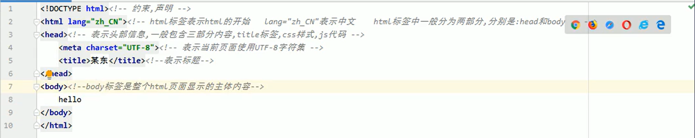

# HTML和CSS基础

&emsp;网页由内容(结构)、表现、行为三部分组成。内容由html实现，样式由CSS实现，行为由javaScript实现。

---

## HTML

### 1.1 标签书写规范



### 1.2 标签介绍

1. 标签格式：<标签名>封装的数据</标签名>
2. 标签名大小写不敏感
3. 标签拥有自己的属性：基本属性和事件属性
4. 标签分为单标签和双标签

### 1.3 常用标签

#### 1.3.1 font标签

&emsp;&lt;font&gt;标签的属性

```html
color 颜色<br>
face 字体<br>
size 字体大小
```

#### 1.3.2 特殊字符

&emsp;常用特殊字符：

```html
<    <
>    >
&nbsp;  空格
```

### 1.4 标题标签

&emsp;&lt;h1&gt;到&lt;h6&gt;，它的属性align是用来对齐的，left(默认)、center、right

### 1.5 超链接标签

&emsp;&lt;a&gt;

```html
href 设置链接地址
target 设置跳转方式
    _self 在当前页面打开链接地址
    _blank 在新页面打开链接地址
```

### 1.6 列表标签

&emsp;分为**无序列表**和**有序列表**

```html
无序列表是<ul>
无序列表的列表向<li>
无序列表的type属性可以改变列表前的符号
```

### 1.7 img标签

```html
&lt;img&gt;用来显示图片
   src属性用以设置图片路径
   width属性用以设置图片宽度
   height属性用以设置图片高度
   border属性用以设置图片边框大小
   alt属性用以设置图片路径不正确时的提示信息
```

### 1.8 表格标签

```html
<table> 表格标签
   border 设置表格边框
   width 设置表格宽度
   height 设置表格高度
   align 设置表格对于页面的对齐方式
   cellspacing 设置单元格间距

<tr> 行标签
   colspan 设置跨列
   rowspan 设置跨行
   

<td> 单元格标签
<th> 表头标签


```

### 1.9 iframe标签

```html
<iframe>
<iframe src=""></iframe>

   src    设置页面源
   width  设置宽度
   height 设置高度

iframe标签和a标签结合使用：
1. 在iframe标签中使用name属性定义一个名称
2. 对a标签中的target属性赋值，值为iframe标签name属性值
```

### 1.10 表单标签

&emsp;表达标签&lt;form&gt;就是html页面中搜集信息的所有元素集合，然后把这些信息发送给服务器。
<br>
&emsp;form标签的<font color=#ff7700>**action**</font>属性设置提交地址。<font color=#ff7700>**method**</font>属性设置提交的方式，默认是GET，可以设置为GET和POST。

```html
<form> 
<!-- 
form标签是表单标签 
input是输入标签
 当input的type属性可以控制input的类型：
    text        文本输入框       value设置默认显示内容
    password    密码输入框       value显示默认显示内容
    radio       单选框          name属性可以对其分组 checked=""checked"表示默认选中
    checkbox    复选框          checked="checked"表示默认选中
    checkbox    复选框          checked="checked"表示默认选中
    reset       重置按钮        value设置按钮上的文本
    submit      提交按钮        value设置按钮上的文本
    button      按钮           value设置按钮上的文本
    file        文件上传按钮     value设置按钮上的文本
    hidden      隐藏域         要发送某些消息，但不需要用户参与时

select是下拉列表标签
    select="select"表示默认选中
option下拉列表中的选项标签

textarea是多行文本输入框标签(起始标签和结束标签内的内容是默认值)
    rows属性设置显示行数
    clos属性设置显示列数

-->
</form>
```

&emsp;<font color=#ddff00>**表单提交的细节：**</font>

* **表单提交的时候，数据没有发送给服务器的三种情况：**<br>
  &emsp; 1. 表单项没有name属性值。<br>
  &emsp; 2. 单选、复选(下拉列表中的option标签)都需要value属性。
  &emsp; 3. 表单项不在提交的form标签中。
* **GET请求的特点是：**<br>
  &emsp; 1. 浏览器的请求地址是action属性值[+?+请求参数]，请求参数的格式是：name=value&name=value...<br>
  &emsp; 2. 不安全<br>
  &emsp; 3. 数据长度有限制
* **POST请求的特点是：**<br>
  &emsp; 1. 浏览器的地址栏只有action的属性值。<br>
  &emsp; 2. 相对与GET要更加安全<br>
  &emsp; 3. 数据长度没有限制<br>

## 1.11 其他标签

* div：默认独占一行
* span：标签内容多长，它的实际长度就是多长
* p：默认会在段落上方和下方空出一行

---

## 2. CSS
&emsp;**CSS语法：** 选择器{属性1:属性值2;属性2:属性值2;...}
<br>
&emsp;**html和CSS结合使用：**

1. 在标签内使用style顺序
2. 在<head>标签中使用&lt;style>标签
3. 把css标签写入到一个.css文件中，在html文件中通过&lt;link>标签引入

## 2.1 CSS选择器
&emsp;通过选择器对html页面中的元素进行选择，如何对其设置样式。
### 2.1.1 标签选择器
&emsp;所有标签都会被动地用到这个样式。语法如下：
``` html
标签名{
  属性 : 属性值
  ... ...
}
```

## 2.2.2 id选择器
&emsp;id选择器可以通过id去选择那些元素使用改样式。语法如下
```html
#id名{
    属性 : 属性值
    ... ...
}
```

## 2.2.3 类选择器
&emsp;每个元素的id是唯一的，但是不同的元素的class值可以不一样，所以可以通过class选择器同时对多个元素进行样式设置。
```html
.class名{
    属性名:属性值
    ... ...
}
```

## 2.2.4 组合选择器
&emsp;组合选择器可以让多个选择器共用一段css样式。
```html
选择器1,选择器2,选择器n{
    属性:属性值
    ... ...
}
```

## 2.2 CSS常用样式
* 颜色 color
* 宽度 width
* 高度 height
* 背景颜色 background-color
* 字体大小 font-size
* div居中 margin-left:auto;margin-right:auto;
* 文本居中 text-align:center
* 超链接去下划线 text-decoration:none

---

# 3. javaScript
&emsp;js运行在客户端，需要靠浏览器来解析执行js代码。js是弱类型语言。

## 3.1 js和html页面结合的方式
1. 在head标签中使用script标签，在script标签中写js代码
2. 使用script标签引入单独的j代码s文件
3. 在body标签中使用script标签，在script标签中写js代码
*第一种和第二种方法不能同时使用*
   
## 3.2 变量
&emsp;**js中的数据类型：** 

| 数据类型 | 关键字 |
| ---- | ---- |
| 数值类型 | number|
| 字符串类型 |　string |
| 对象类型 | object |
| 布尔类型 | boolean |
| 函数类型 | function |

&emsp;**js中的特殊值：**
1. undefined
2. null
3. nan

```javascript
// js中定义变量的格式
var 变量名;
var 变量名 = 变量值;
```

## 3.3 运算操作
1. 等于 == 简单的做字面值的比较
2. 全等于 === 除了做字面值的比较之外，还会比较两个变量的类型
3. 且运算 &&
4. 或运算 ||
5. 取反运算 !
